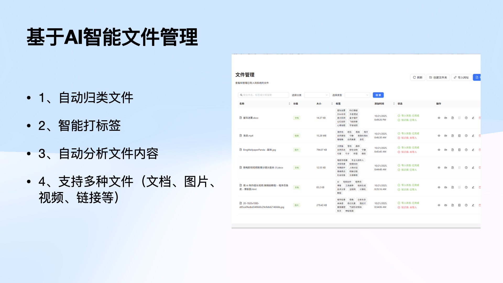
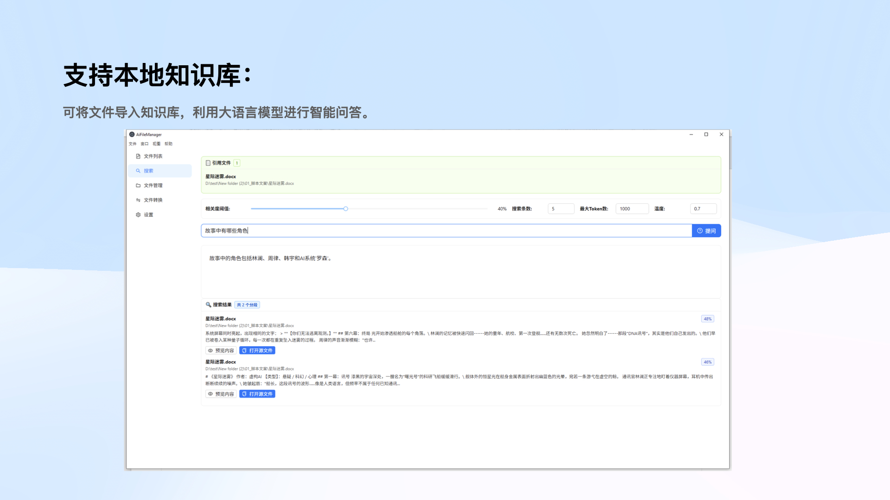
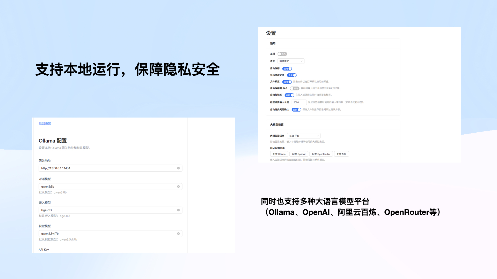

# AI 文档管理器

一款基于 AI 的智能文件管理器。它可以自动将你导入的文件归类到最合适的文件夹，并根据内容智能打标签，方便后续的搜索和查找。同时，你还可以把文件导入到本地知识库，利用大语言模型进行智能问答。

## 功能特性
 
 
 
 
 

- 📁 **文档导入与管理** - 支持多种文档格式，自动转换为 Markdown 格式
- 🏷️ **智能分类** - 自动对文档进行分类和标签管理
- 🔍 **语义搜索** - 基于向量数据库的智能文档检索
- 💬 **智能问答** - 基于 RAG 技术的文档内容问答
- 🗄️ **本地存储** - 所有数据本地存储，保护隐私安全
- 🖥️ **跨平台支持** - 支持 Windows 和 macOS 系统

## 技术架构

- **前端界面**: Electron + React + TypeScript
- **本地服务层**: 嵌入在 Electron 主进程中的 Node.js（Express）本地服务
- **文档处理**: 基于可配置的 `fileConvertEndpoint` 远程转换服务，由 Node 统一调度
- **数据存储**: SQLite（通过 Sequelize 维护元信息）+ Faiss 向量索引（faiss-node）
- **AI 模型**: 可插拔的 LLM / Embedding 提供方（OpenAI、Azure、OpenRouter、百炼、Ollama 等）

## 项目结构

```
ai_file_manager/
├── client/
│   ├── electron/       # Electron 主进程与嵌入式 Express API
│   ├── renderer/       # React/Vite 前端界面
│   ├── public/         # 前端静态资源
│   └── package.json    # 客户端脚本与依赖
├── database/           # SQLite 与 FAISS 向量索引文件（运行时生成）
├── locales/            # 旧版翻译回退资源
├── temp/               # 文件导入/转换的临时目录
└── README.md
```

## 主要功能模块

### 1. 文件管理
- 文档导入与格式转换
- 自动分类和摘要生成
- 文件列表与筛选功能

### 2. 智能检索
- 基于语义的文档搜索
- 支持关键词和自然语言查询
- 相关度排序展示结果

### 3. RAG 问答
- 基于文档内容的智能问答
- 提供答案来源追溯
- 支持上下文理解

### 4. 本地数据管理
- SQLite 存储文档元信息
- 向量数据库存储文档 embeddings
- 本地模型部署，数据不上传

## 开发状态

🚧 项目正在开发中...

## 许可证

MIT License

## 国际化

共享翻译文件位于 `client/locales/`。React 渲染进程通过 `@locales` 引入 JSON 文本，Electron 主进程 (`client/electron/languageHelper.ts`) 也会加载同一路径，并在缺少资源时回退到根目录 `locales/`。若需新增语言，请在 `client/locales/` 下创建 `<lang>.json` 并保持与现有结构一致，重启应用即可生效。